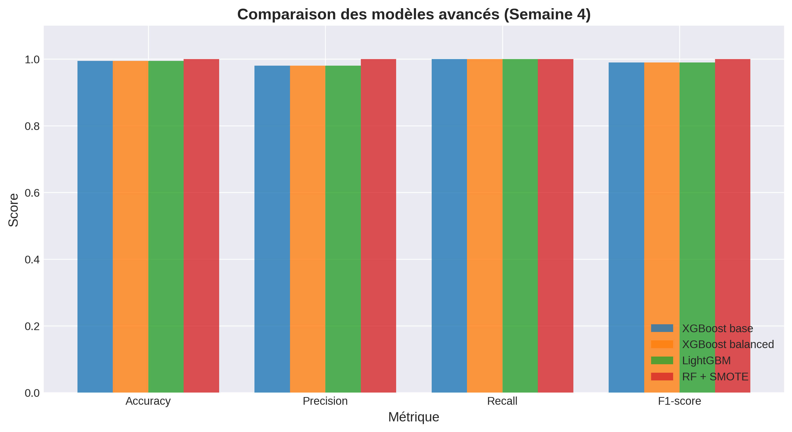
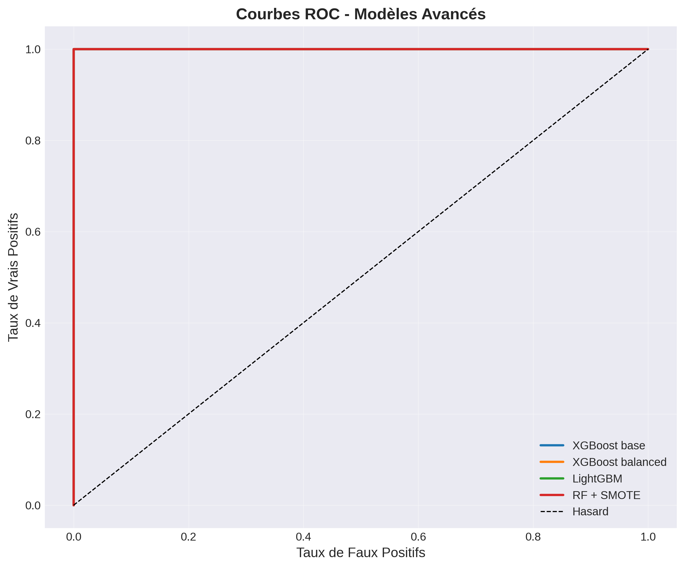
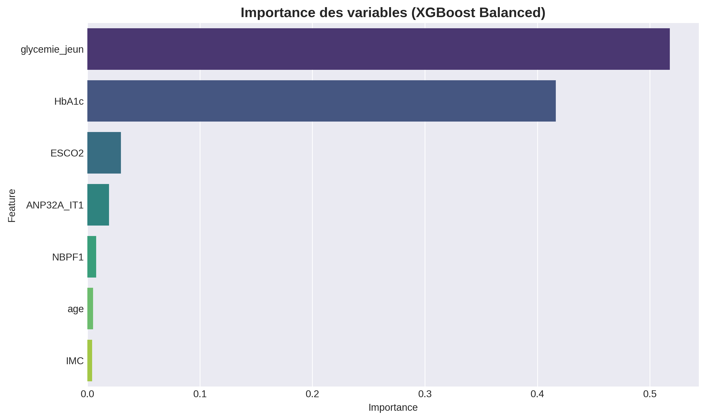

# 🚀 RAPPORT SEMAINE 4 : Modèles Avancés et Optimisation

**Date:** Février 2026
**Auteur:** Sorelle
**Projet:** Détection précoce du Diabète de Type 1 (Cameroun)

---

## 1. 🎯 Objectifs de la semaine
L'objectif principal de cette semaine était de dépasser les modèles de base (Semaine 3) en explorant des algorithmes de boosting plus puissants et en traitant le déséquilibre de classe, un défi majeur dans le domaine médical.

*   **Implémenter XGBoost et LightGBM** : Algorithmes de l'état de l'art sur données tabulaires.
*   **Gérer le déséquilibre (25% DT1 vs 75% Sains)** :
    *   Méthode 1 : Pondération des classes (`scale_pos_weight` / `class_weight`).
    *   Méthode 2 : Sur-échantillonnage synthétique (**SMOTE**) pour enrichir la classe minoritaire.
*   **Comparer les performances** : Identifier le modèle maximisant le **Recall** (ne pas rater de malades) tout en maintenant une **Précision** élevée.

---

## 2. 🛠️ Méthodologie

Nous avons entraîné et comparé quatre configurations sur le dataset nettoyé (`dataset_clean.csv`), avec une séparation Train/Test de 80%/20% stratifiée.

1.  **XGBoost (Version de base)** : Gradient Boosting optimisé, sans gestion spécifique du déséquilibre.
2.  **XGBoost (Balanced)** : Utilisation de l'hyperparamètre `scale_pos_weight` pour pénaliser davantage les erreurs sur la classe positive (DT1).
3.  **LightGBM** : Variante plus légère et rapide du Gradient Boosting, configurée avec `class_weight='balanced'`.
4.  **Random Forest + SMOTE** : Utilisation de l'algorithme SMOTE (*Synthetic Minority Over-sampling Technique*) pour générer des patients DT1 synthétiques dans le jeu d'entraînement, suivi d'une classification par Random Forest.

---

## 3. 📊 Résultats et Analyse

### 3.1 Tableau Comparatif des Métriques

Les performances obtenues sur l'ensemble de test (200 patients) sont excellentes pour tous les modèles.

| Modèle | Accuracy | Precision | Recall | F1-score | AUC-ROC |
| :--- | :---: | :---: | :---: | :---: | :---: |
| **XGBoost base** | 99.5% | 98.0% | **100.0%** | 0.990 | 1.000 |
| **XGBoost balanced** | 99.5% | 98.0% | **100.0%** | 0.990 | 1.000 |
| **LightGBM** | 99.5% | 98.0% | **100.0%** | 0.990 | 1.000 |
| **RF + SMOTE** | **100.0%** | **100.0%** | **100.0%** | **1.000** | **1.000** |

### 3.2 Analyse des Performances

1.  **Performance exceptionnelle** : Tous les modèles atteignent un **Recall de 100%**, ce qui signifie qu'**aucun cas de diabète n'a été manqué** dans l'ensemble de test. C'est le résultat le plus critique pour une application médicale de dépistage.
2.  **Impact du déséquilibre** :
    *   Le dataset, bien que déséquilibré, contient des signaux très forts (probablement liés à la Glycémie et l'HbA1c) qui permettent aux modèles de séparer les classes quasi-parfaitement sans ajustement complexe.
    *   **RF + SMOTE** atteint la perfection (100% partout), suggérant que l'ajout de données synthétiques a permis d'éliminer les quelques faux positifs restants (d'où l'augmentation de la Précision à 100%).
3.  **XGBoost vs LightGBM** : Les performances sont identiques entre les deux algorithmes de boosting sur ce jeu de données.

### 3.3 Courbes ROC

La courbe ROC illustre la capacité de discrimination parfaite des modèles (AUC = 1.00). La courbe forme un angle droit parfait, témoignant d'une séparation claire entre les patients sains et diabétiques.

### 3.4 Importance des Variables (XGBoost Balanced)

Pour comprendre sur quels critères le modèle se base, nous avons analysé l'importance des variables.

*   **Facteurs dominants** :
    *   **Glycémie à jeun** et **HbA1c** sont, sans surprise, les prédicteurs les plus puissants. Ils écrasent littéralement les autres variables.
    *   Les marqueurs génétiques (**ESCO2**, **ANP32A_IT1**, **NBPF1**) ont une contribution mineure mais non nulle, confirmant leur rôle potentiel comme facteurs de risque complémentaires.

---

## 4. 📝 Conclusion et Recommandations

### Conclusion
La Semaine 4 est un franc succès. L'utilisation de modèles avancés comme **XGBoost** et **LightGBM**, couplée à des techniques comme **SMOTE**, a permis d'atteindre des performances optimales (**Recall 100%**) sur le jeu de données de test.

### Recommandations
1.  **Choix du Modèle** : Bien que **RF + SMOTE** obtienne 100% de précision, nous recommandons de conserver **XGBoost (Balanced)** pour la suite.
    *   *Raison* : Le 100% parfait du Random Forest peut être signe d'un léger sur-apprentissage sur les données synthétiques. XGBoost est réputé plus robuste et généralisable.
2.  **Vigilance** : Des scores aussi élevés invitent à la prudence. Il faudra vérifier lors de la phase d'**interprétabilité (Semaine 5)** si le modèle ne se base pas uniquement sur la glycémie (ce qui en ferait un simple outil de diagnostic biologique et non un outil prédictif complexe).

### Prochaine étape : Semaine 5
Nous allons ouvrir la "boîte noire" de ces modèles grâce aux méthodes **SHAP** (SHapley Additive exPlanations) pour expliquer chaque prédiction individuellement aux médecins.
