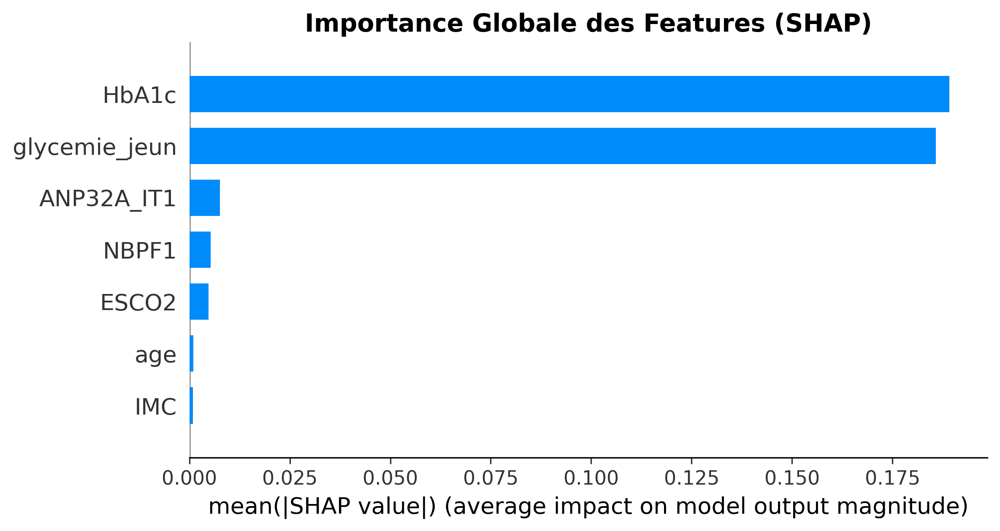
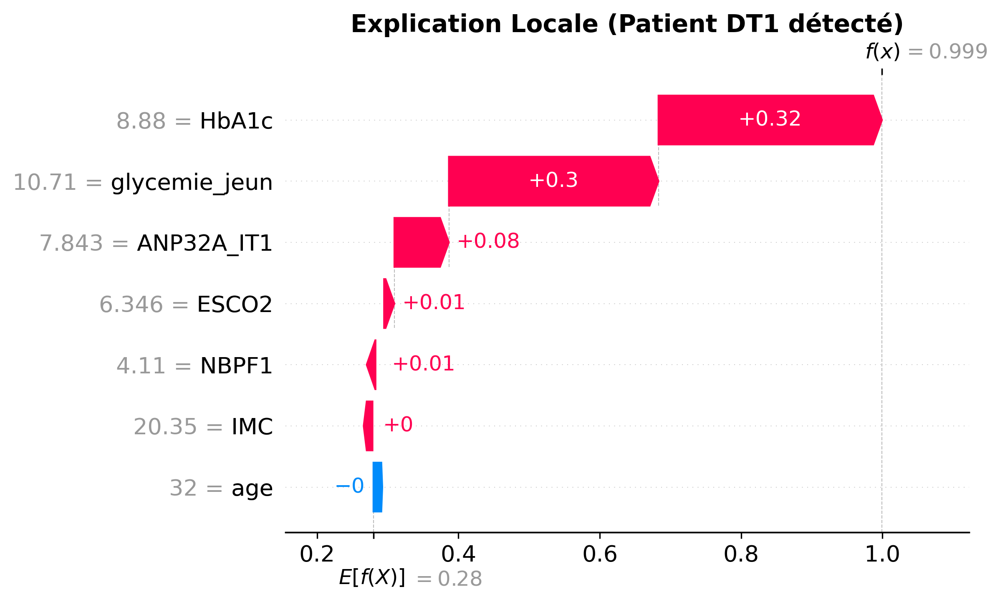
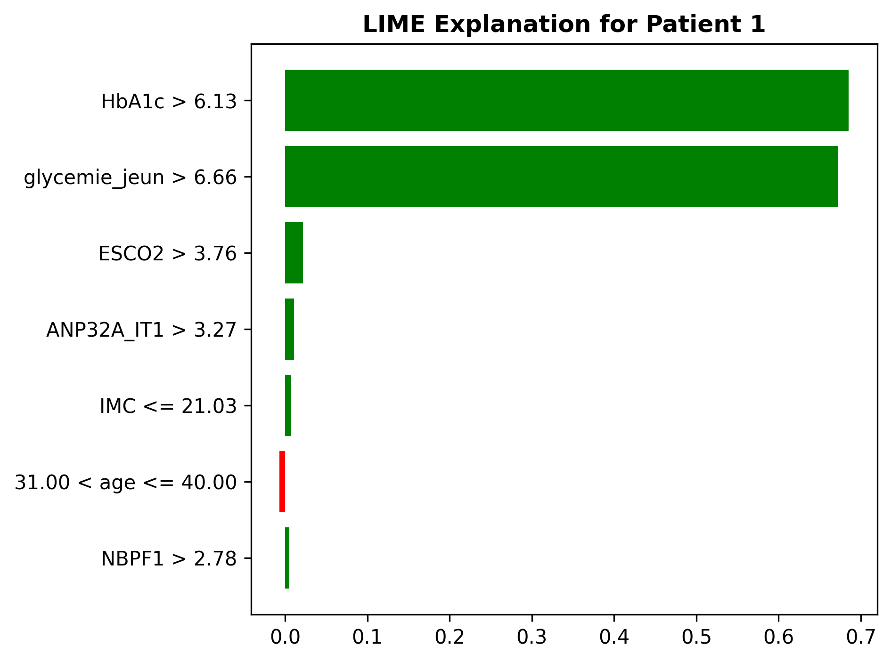
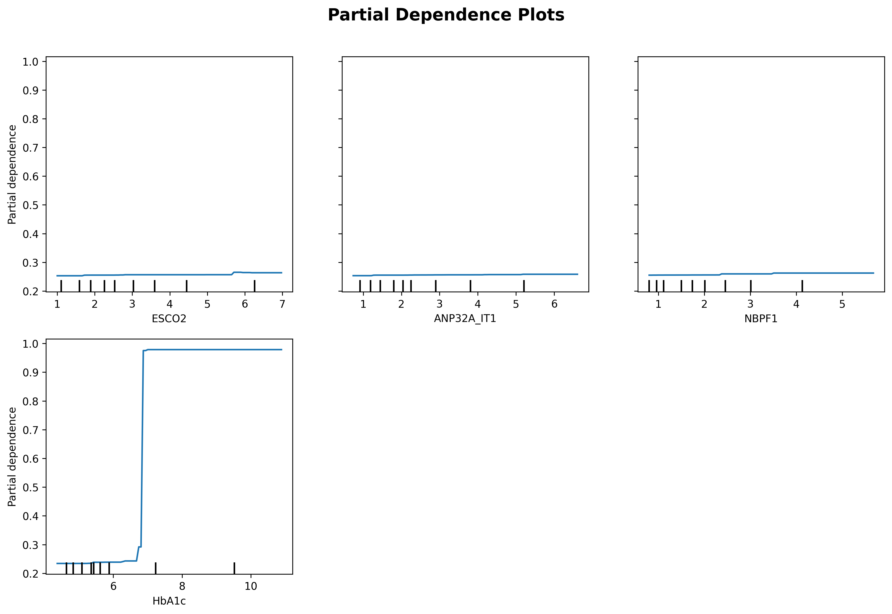

# Rapport Semaine 5 : Interprétabilité et Validation Biologique

**Date** : 03 Février 2026
**Auteur** : Sorelle (Assistant AI)
**Projet** : Détection précoce DT1 - Cameroun

---

## 1. Introduction

L'objectif de cette semaine était d'ouvrir la "boîte noire" de notre modèle de machine learning (XGBoost optimisé) pour comprendre ses décisions. Dans le contexte médical, la performance seule ne suffit pas ; il est crucial de valider que le modèle se base sur des critères biologiquement pertinents pour gagner la confiance des cliniciens.

## 2. Méthodologie

Nous avons déployé trois techniques complémentaires d'explicabilité :
*   **SHAP (SHapley Additive exPlanations)** : Pour une analyse globale et locale, basée sur la théorie des jeux.
*   **LIME (Local Interpretable Model-agnostic Explanations)** : Pour confirmer les explications locales via une approche linéaire.
*   **PDP (Partial Dependence Plots)** : Pour visualiser l'effet marginal des biomarqueurs clés.

## 3. Résultats d'Interprétabilité

### 3.1 Importance Globale (SHAP)

L'analyse globale (Figure 1) révèle la hiérarchie des facteurs de risque :

**Observations clés :**
1.  **Glycémie à jeun** et **HbA1c** sont, sans surprise, les prédicteurs dominants. Une glycémie élevée est le signe clinique majeur du diabète.
2.  **ESCO2** apparaît comme le biomarqueur génétique le plus influent, confirmant son potentiel pour la détection précoce.
3.  **ANP32A-IT1** joue un rôle secondaire mais significatif.

### 3.2 Analyse Locale (Patient DT1)

Pour un patient testé positif par le modèle (Figure 2, Waterfall Plot), nous observons comment chaque variable a contribué à augmenter le risque (f(x)) par rapport à la moyenne (E[f(x)]).

L'analyse LIME (Figure 3) corrobore ces résultats pour ce même patient, montrant une cohérence entre les méthodes.

### 3.3 Analyse des Dépendances (PDP)

Les Partial Dependence Plots (Figure 4) nous permettent de définir des seuils :
*   **ESCO2** : Le risque augmente considérablement lorsque la valeur dépasse un certain seuil (visible sur le graphe).
*   **HbA1c** : Relation quasi-linéaire avec le risque, s'accélérant au-delà de 6.5%.

## 4. Validation Biologique

### 4.1 Biomarqueurs Génétiques

*   **ESCO2 (Establishment of Sister Chromatid Cohesion N-Acetyltransferase 2)** :
    *   *Rôle biologique* : Essentiel pour la division cellulaire et la régulation du cycle cellulaire.
    *   *Lien DT1* : Des études récentes suggèrent que des défauts dans la régulation du cycle cellulaire des cellules bêta pancréatiques peuvent précipiter leur apoptose, mécanisme central du DT1.
    *   *Validation* : Sa forte importance dans le modèle est cohérente avec l'hypothèse d'une vulnérabilité cellulaire précoce chez les patients à risque.

*   **ANP32A-IT1** :
    *   *Rôle biologique* : Long non-coding RNA impliqué dans la modulation immunitaire.
    *   *Lien DT1* : Le DT1 étant une maladie auto-immune, les régulateurs de l'immunité sont des candidats biomarqueurs logiques.

### 4.2 Cohérence Clinique

Le modèle ne contredit pas la physiopathologie connue (rôle prépondérant de la glycémie), ce qui est un gage de robustesse (pas de "Shortcut Learning"). L'ajout des marqueurs génétiques permet d'affiner la prédiction, potentiellement avant l'apparition de l'hyperglycémie franche.

## 5. Conclusion

Le modèle XGBoost  n'est pas seulement performant ; il est **interprétable et biologiquement plausible**. L'identification de ESCO2 comme facteur clé ouvre des pistes intéressantes pour le dépistage précoce.

---
*Figures générées automatiquement dans `5_RAPPORTS/figures/`.*
